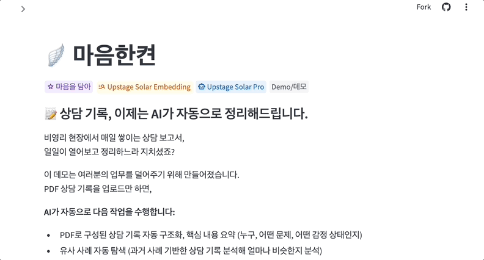
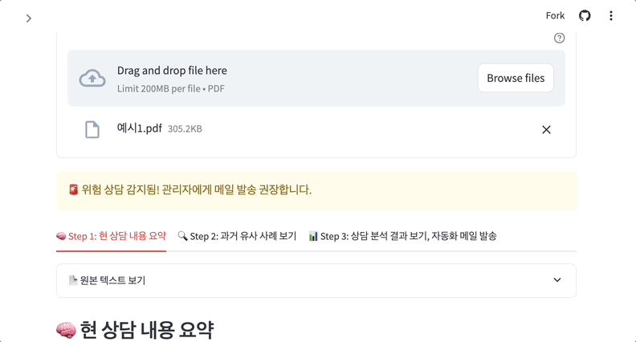
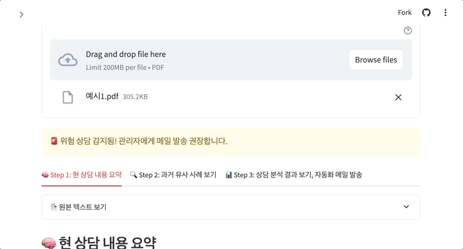
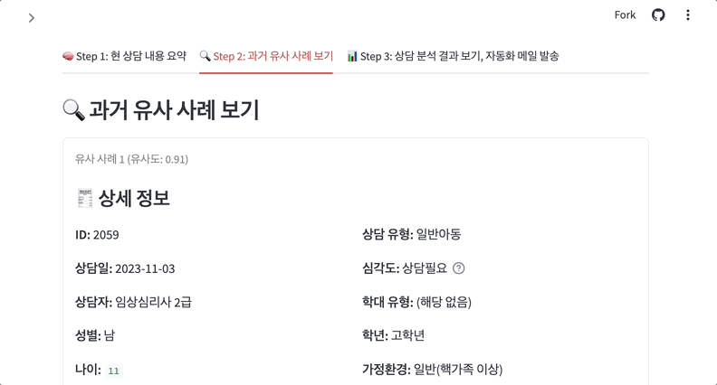
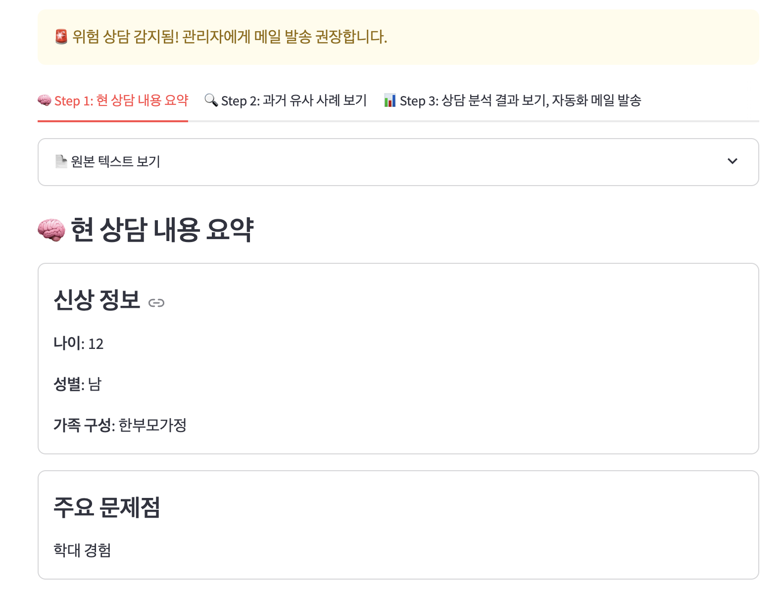
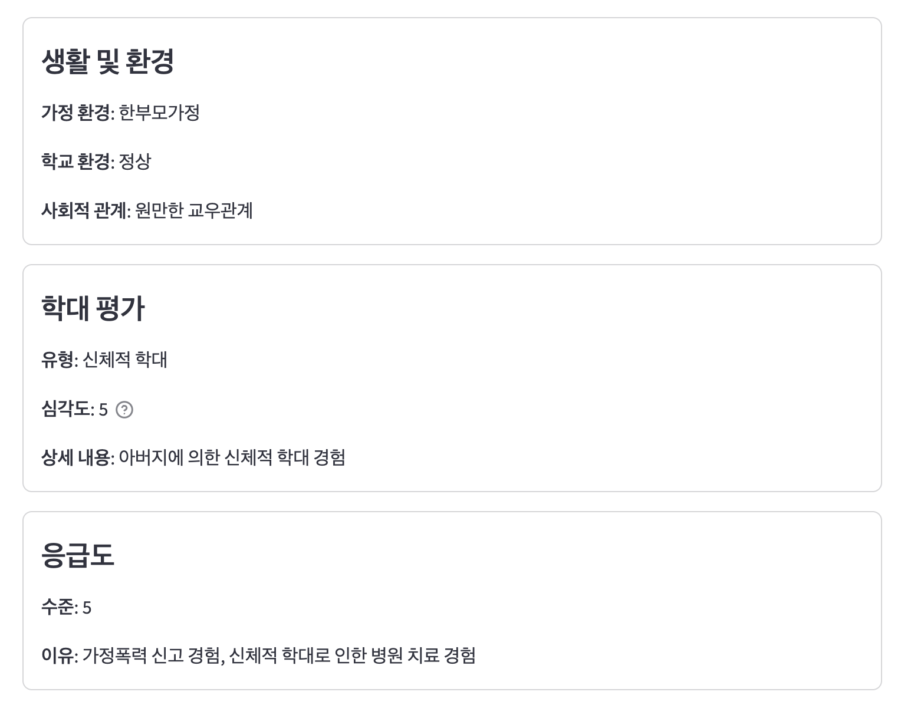
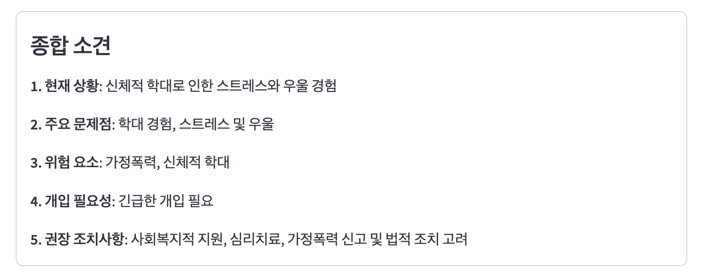
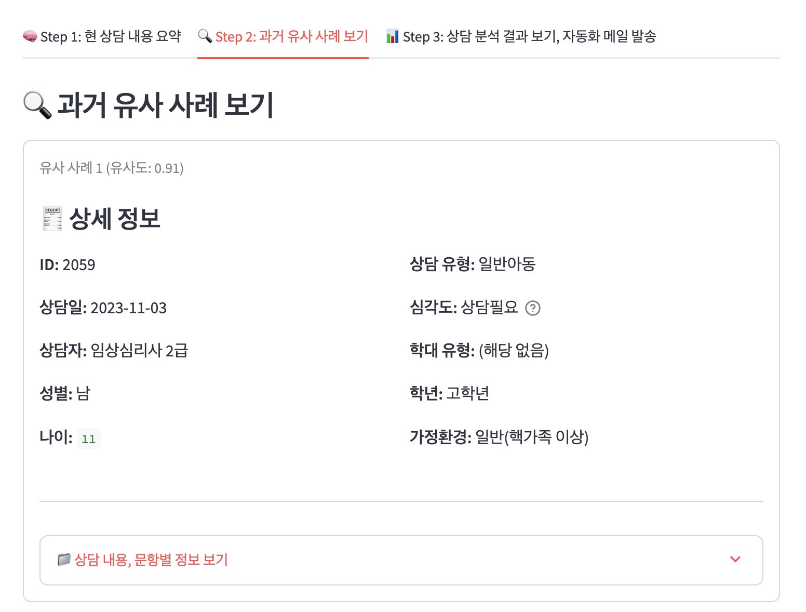
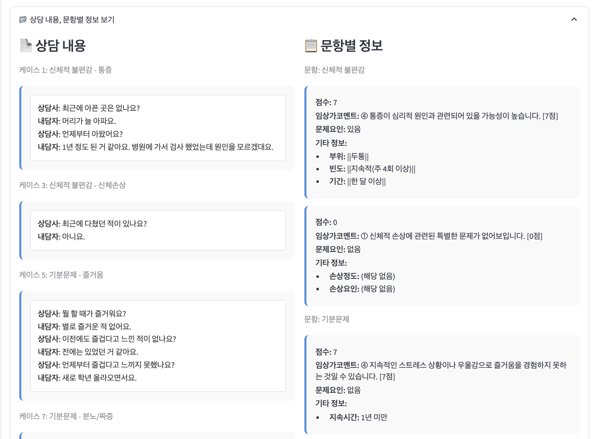
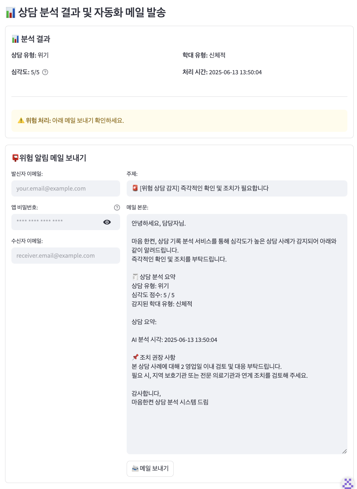

# Product UseCase 프로젝트 문서: 상담 기록 유형 분석 및 알림 자동화 시스템

🔗 [프로젝트 바로가기](https://upstage-usecase-ybigta.streamlit.app/)

## 📌 목차 (Table of Contents)
- [Product UseCase 프로젝트 문서: 상담 기록 유형 분석 및 알림 자동화 시스템](#product-usecase-프로젝트-문서-상담-기록-유형-분석-및-알림-자동화-시스템)
  - [📌 목차 (Table of Contents)](#-목차-table-of-contents)
  - [📜 1. 프로젝트 개요 (Overview)](#-1-프로젝트-개요-overview)
    - [해결하고자 하는 니즈:](#해결하고자-하는-니즈)
    - [Tech Stack:](#tech-stack)
  - [🎬 2. 데모 시나리오 (Usecase Scenario)](#-2-데모-시나리오-usecase-scenario)
  - [✨ 3. 기능 요약 (Features)](#-3-기능-요약-features)
    - [주요 기능](#주요-기능)
    - [기능 명세](#기능-명세)
  - [📂 4. 프로젝트 구조 (Project Structure)](#-4-프로젝트-구조-project-structure)
  - [🚀 5. 설치 및 실행 방법 (Installation \& Execution)](#-5-설치-및-실행-방법-installation--execution)
  - [📖 6. 사용 방법 (How to Use)](#-6-사용-방법-how-to-use)
    - [PDF 업로드](#pdf-업로드)
    - [결과 확인](#결과-확인)
  - [📦 7. 주요 의존성 (Dependencies)](#-7-주요-의존성-dependencies)
  - [🔌 8. API 설명 (API Description)](#-8-api-설명-api-description)
  - [🎯 9. 결과 예시 / 캡처 (Sample Output)](#-9-결과-예시--캡처-sample-output)
  - [⚠️ 10. 주의사항 및 한계 (Limitations \& Notes)](#️-10-주의사항-및-한계-limitations--notes)
  - [🧑‍🤝‍🧑 11. 기여자 및 라이선스 (Contributors / License)](#-11-기여자-및-라이선스-contributors--license)
    - [Contributors](#contributors)
  
## 📜 1. 프로젝트 개요 (Overview)

> 본 프로젝트는 **비영리 단체의 상담 기록 관리 효율화**를 목표로 합니다. PDF 형태로 흩어져 있는 상담 기록을 시스템에 업로드하면, 해당 문서를 자동으로 구조화하고 핵심 내용을 요약합니다. 또한, 상담 내용의 유형과 위기 단계를 분석하고, 유사한 과거 상담 사례를 추천하여 사례 관리자의 행정 부담을 줄이고 위기 상황에 신속하게 대응할 수 있도록 지원합니다.

### 해결하고자 하는 니즈:
  1. **상담 기록의 누적**: 수기·PDF 문서가 통합되지 않아 검색 및 분석 어려움
  2. **고위험 케이스 탐지 어려움**: 자살/폭력 등 고위험 문구를 수작업으로 판별
  3. **사례 검색 및 공유의 어려움**: 유사 사례를 수동으로 찾아야 하는 비효율

### Tech Stack:

 
 
 


---

## 🎬 2. 데모 시나리오 (Usecase Scenario)
> 아동 상담 기관의 사례 관리자가 새로운 상담을 마친 후, 상담 내용을 정리한 PDF 문서를 해당 웹페이지에 업로드합니다. 시스템은 수초 내에 아래와 같은 분석 결과를 대시보드에 표시합니다.

1.  **자동 요약**: 전체 상담 내용이 내담자 정보, 주요 문제, 생활 및 환경, 학대 평가, 응급도, 종합소견으로 요약되어 나타납니다.
2.  **위기 단계 분류**: 상담 내용이 '신체적 학대'등 어떤 유형에 속하는지, 심각도는 어느 정도인지 표시됩니다.
3.  **유사 사례 추천**: 시스템에 구축된 AI-Hub 상담 데이터베이스에서 현재 상담과 가장 유사한 과거 사례 3건을 찾아 보여주어 대응 방안 수립에 참고할 수 있습니다.
4.  **위험 알림**: 만약 분석 결과 '학대'와 같은 고위험 징후가 감지되면, 자동으로 담당자에게 위험 상황을 알리는 이메일을 발송할 수 있습니다.

---

## ✨ 3. 기능 요약 (Features)
### 주요 기능
-   **📄 문서 파싱 (Document Parsing)**: PDF 문서를 업로드하면 Upstage Document AI API를 통해 텍스트와 구조를 추출합니다.
-   **✨ 텍스트 정제 (Text Cleaning)**: 이름, 학교 등 개인정보를 익명화하여 민감정보 노출을 방지합니다.
-   **📝 AI 요약 (Summarization)**: Upstage Solar LLM을 활용해 긴 상담 기록의 핵심 내용을 자동으로 요약합니다.
-   **🏷️ AI 분류 (Classification)**: 상담 내용을 기반으로 '상담 유형', '위기 단계', '학대 유형'을 자동으로 분류합니다.
-   **🔍 유사 사례 검색 (Retrieval)**: FAISS 벡터 DB에 저장된 상담 데이터셋에서 현재 기록과 가장 유사한 사례를 검색하여 제시합니다.
-   **🚨 위험 알림 (Alerting)**: 분석된 위기 단계가 일정 수준 이상일 경우, 지정된 담당자에게 이메일로 알림을 발송할 수 있습니다.

### 기능 명세 
<details>
<summary><strong>⚙️ 기능 명세 펼쳐보기 </strong></summary>

- 시스템 구축 파이프라인

| # | 모듈                 | 설명                | 입력      | 출력          | 비고                    |
| - | ------------------ | ----------------- | ------- | ----------- | --------------------- |
| 1 | AI-Hub Data Loader | AI-Hub 데이터셋 로딩    | \*.json | 원문 텍스트      |                       |
| 2 | Text Clean & 익명화   | 이름/학교/지역 등 마스킹 처리 | 원문 텍스트  | 정제 텍스트      |                       |
| 3 | Solar Embedding    | 상담 내용을 벡터화        | 정제 텍스트  | 벡터          | Upstage Embedding API |
| 4 | Vector DB 구축       | 검색용 DB 구축         | 벡터 + 메타 | faiss.index |                       |

- 사용자 흐름 파이프라인

| # | 모듈               | 설명                        | 입력     | 출력           | 비고             |
| - | ---------------- | ------------------------- | ------ | ------------ | -------------- |
| 1 | PDF 업로드          | 사용자 상담기록 업로드              | PDF    | 파일 경로        |                |
| 2 | Document Parse   | 문서 OCR + 구조화              | PDF    | HTML 텍스트     | Upstage API 사용 |
| 3 | Text Clean & 익명화 | 텍스트 전처리 및 익명화             | 텍스트    | 정제 텍스트       |                |
| 4 | Solar LLM 요약     | 핵심 내용 요약                  | 정제 텍스트 | 요약문          |                |
| 5 | Solar Embedding  | 임베딩 벡터 생성                 | 정제 텍스트 | 벡터           |                |
| 6 | 유사 사례 검색         | FAISS를 통해 3건 검색           | 벡터     | 유사 사례 리스트    |                |
| 7 | Solar LLM 분류     | 상담 유형, 위기 단계, 학대 유형 분류    | 정제 텍스트 | 분류 결과 (JSON) |                |
| 8 | 위험 알림            | 위기단계≥3 또는 학대≠없음일 경우 메일 발송 | 분류 결과  | 메일 전송 로그     |                |
| 9 | 대시보드             | 요약, 유형, 유사사례, 로그 시각화      | 전체 결과  | 웹 페이지        | Streamlit 등 사용 |

</details>


---

## 📂 4. 프로젝트 구조 (Project Structure)
본 프로젝트의 소스 코드 구조는 다음과 같으며, 이는 개발 및 유지보수를 위한 참고 자료입니다. 최종 사용자는 웹 애플리케이션의 UI를 통해서만 서비스와 상호작용합니다.
```
├── document_example/      # 데모용 PDF 샘플
│   └── ... 
├── faiss_index/
│   ├── index.faiss        # FAISS 벡터 DB 인덱스 파일
│   └── index.pkl          # FAISS 인덱스 관련 직렬화 파일
├── images/                # 이미지 데이터 디렉토리
│   └── ... 
├── origin/                # 원본 데이터 디렉토리
│   └── ... 
├── processed/
│   └── ...                # 전처리된 데이터 디렉토리
├── utils/
│   ├── classifier.py      # Solar LLM을 이용한 상담 유형 및 심각도 분류 모듈
│   ├── document_parser.py # 문서 파싱(OCR 등) 처리 모듈
│   ├── embedder.py        # 텍스트 임베딩 처리 모듈
│   ├── logger.py          # 로깅 설정 모듈
│   ├── mailer.py          # 이메일 발송 모듈
│   ├── renderer.py        # UI 렌더링 관련 유틸리티 모듈
│   ├── search_faiss.py    # FAISS 인덱스 검색 모듈
│   ├── sidebar.py         # Streamlit 사이드바 모듈
│   ├── summarizer.py      # Solar LLM을 이용한 상담내용 요약 모듈
│   └── text_cleaner.py    # 텍스트 정제 및 익명화 모듈
├── .env.example           # 환경 변수 예시 파일
├── .gitignore             # Git 추적 제외 파일 목록
├── app.py                 # Streamlit 웹 애플리케이션 실행 파일
├── data_processing.py     # 데이터 전처리 및 FAISS DB 구축 스크립트
├── embedding.py           # 임베딩 생성 관련 스크립트
├── readme.md              # 프로젝트 설명 문서
├── requirements.txt       # 프로젝트 의존성 패키지 목록
├── run_demo.sh            # 데모 실행 스크립트
├── runtime.txt            # (배포용) Python 버전 지정 파일
└── test.py                # 테스트 코드 파일
```

---

## 🚀 5. 설치 및 실행 방법 (Installation & Execution)

**1. 서비스 접속**
- 웹 브라우저를 통해 아래 제공된 URL에 접속합니다.
- 🔗 [URL](https://upstage-usecase-ybigta.streamlit.app/)

**2. 관리자 참고: 환경 변수 설정**

- 본 서비스는 Upstage API 키와 이메일 서버 정보 등 민감한 정보를 배포 환경의 환경 변수(Environment Variables) 또는 Secrets 관리 기능을 통해 설정합니다.
- 로컬 개발 시 사용되는 .env 파일은 서버 배포 환경에서는 사용되지 않으며, 관리자는 배포 플랫폼(예: Streamlit Community Cloud, AWS, Google Cloud)의 설정 메뉴에서 직접 API 키를 안전하게 입력해야 합니다.

---

## 📖 6. 사용 방법 (How to Use) 

🔗 [프로젝트 바로가기](https://upstage-usecase-ybigta.streamlit.app/)


### PDF 업로드

- 서비스 URL에 접속하 후, 화면 아래 파일 업로드 창에 분석할 상담 기록 PDF 파일을 드래그 앤 드롭하거나 선택하여 업로드합니다.
- 업로드가 완료되면 파싱부터 전처리, 요약, 유사사례 검색, 분류까지의 진행상황이 표시됩니다.

### 결과 확인
- 처리가 완료되면 대시보드에 아래와 같은 분석 결과가 나타납니다.

**1. 현 상담 내용 요약** 
- 내담자의 신상정보, 주요 문제점, 생활 및 환경, 학대여부, 응급도, 종합 소견이 요약되어 나타납니다.
- 원본 텍스트 보기를 클릭 시 전체 텍스트를 확인할 수 있습니다.


**2. 과거 유사 사례 보기** 
- AI-Hub 데이터 기반 유사 사례 3건에 대한 상세 정보를 확인할 수 있습니다.
- 상담 내용, 문항별 정보 보기 토글을 클릭 시 유사 사례 상담 내용 전체를 확인할 수 있습니다.


**3. 위험 분석 결과 보기 및 메일 발송 (위험도)** 
- 해당 상담의 구분된 심각도 단계와 학대 유형을 확인할 수 있습니다.
- 고위험으로 판단될 경우, 담당자에게 위험 알림 메일을 전송할 수 있습니다. 
- 메일 발송 관련 가이드는 화면 왼쪽의 사이드바를 참고해주세요.


---

## 📦 7. 주요 의존성 (Dependencies)
본 프로젝트는 `requirements.txt`에 명시된 라이브러리들을 사용합니다. 
```
streamlit>=1.32.0
python-dotenv>=1.0.0
numpy>=1.24.0

LangChain and Upstage
langchain>=0.1.17
langchain-core>=0.1.50
langchain-community>=0.0.25
langchain-upstage>=0.0.20

Vector DB
faiss-cpu>=1.7.4

Email support
secure-smtplib
```

---


## 🔌 8. API 설명 (API Description)
-   **Upstage Document AI API**: PDF 문서의 레이아웃을 분석하고 텍스트를 추출(OCR)하는 데 사용됩니다.
-   **Upstage Solar LLM API**: 추출된 텍스트를 기반으로 내용을 요약하고, 상담 유형, 위기 단계, 학대 유형을 분류하는 데 사용됩니다.
-   **Upstage Embedding API**: 정제된 텍스트를 고차원 벡터로 변환하여 유사도 기반 검색이 가능하도록 합니다.

---

## 🎯 9. 결과 예시 / 캡처 (Sample Output)

<details>
<summary><strong>결과 예시 캡쳐본 펼쳐보기 </strong></summary>

**1. 현 상담 내용 요약** 





**2. 과거 유사 사례 보기** 



**3. 위험 분석 결과 보기 및 메일 발송 (위험도)** 

</details>

## ⚠️ 10. 주의사항 및 한계 (Limitations & Notes)
- **API Key 관리**: 서비스 배포 환경(예: Streamlit Community Cloud, AWS Secrets Manager 등)에 설정된 Upstage API 키가 외부에 노출되지 않도록 안전하게 관리해야 합니다. 소스 코드나 공개된 저장소에 API 키를 직접 포함하지 마십시오.
- **데이터 의존성**: 유사 사례 추천 기능의 정확도는 faiss_index에 구축된 AI-Hub 상담 데이터에 의존합니다.
- **문서 형식**: 현재 시스템은 텍스트 기반의 PDF 상담 기록에 최적화되어 있으며, 복잡한 표나 이미지가 포함된 문서에서는 성능이 저하될 수 있습니다.
  
---

## 🧑‍🤝‍🧑 11. 기여자 및 라이선스 (Contributors / License)
### Contributors
윤희찬, 김민서, 문찬우, 방준현, 송휘린
  
<a href="https://github.com/quant-jason">
  
</a>
<a href="https://github.com/min214kim">
  
</a>
<a href="https://github.com/urbanking">
  
</a>
<a href="https://github.com/bindingflare">
  
</a>
<a href="https://github.com/Hwiplash">
  
</a>

